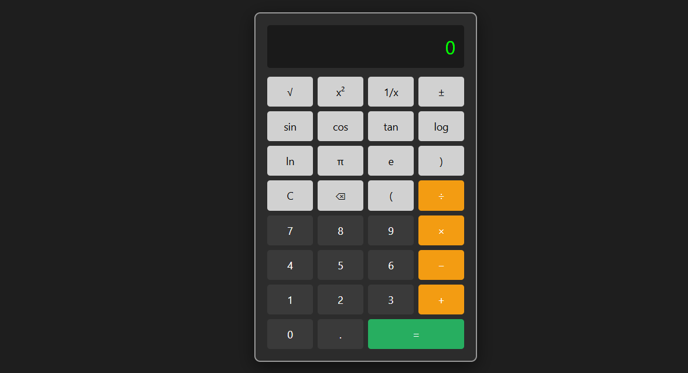

# 🧮 Calculadora Científica

Calculadora científica feita com **HTML**, **CSS** e **JavaScript**. Inspirada no design tradicional de calculadoras físicas (Casio, HP), com funções científicas completas.

## ✅ Funcionalidades

- Operações básicas: +, −, ×, ÷
- Raiz quadrada, potência ao quadrado, 1/x
- Funções trigonométricas: sin, cos, tan (graus)
- Logaritmos: log (base 10), ln (natural)
- Constantes: π, e
- Teclado funcional (suporte para teclado físico)
- Responsivo e com layout semelhante a uma calculadora real

## 🚀 Tecnologias

- HTML5
- CSS3
- JavaScript (puro)

## 💻 Demonstração

Acesse aqui: [https://github.com/Silvami223/calculadora-cientifica](https://github.com/Silvami223/calculadora-cientifica)

## 📷 Captura de tela

---

Feito com 💚 por [Michelle Bispo] [https://github.com/Silvami223](https://github.com/Silvami223)
